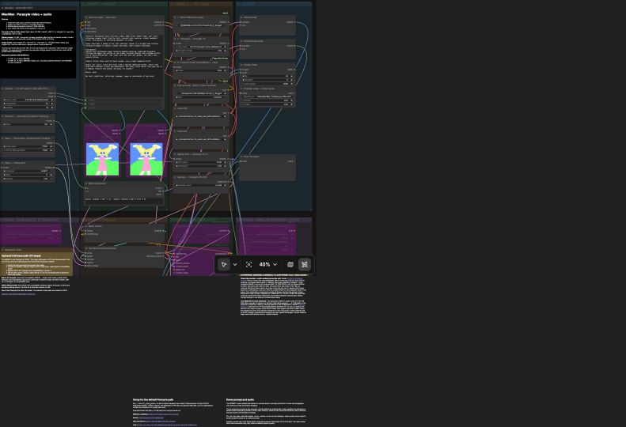

# MacMax — MiniMax H3 on Apple Silicon

Video and native stereo audio, generated together in ComfyUI on a Mac. **One workflow, with Parasyte Turbo enabled by default.** Start with text, supply an image, or guide both the first and last frames.

**[Download the release](https://github.com/Bambushu/minimax-h3-mac/releases/latest)** · [Workflow JSON](MacMax_MiniMaxH3_AppleSilicon.json) · [Watch the default demo](samples/sample_MacMax_t2v.mp4)

Tested on a **48 GB M5 Pro using MPS**, including a fresh ComfyUI installation. Smaller-memory Macs have not been validated. The five default models need approximately **37 GB of disk space**, plus ComfyUI and its dependencies.

[](docs/workflow.png)

*The main canvas in local ComfyUI. Optional blocks sit below; image placeholders are bypassed by default.*

## Setup

Use a ComfyUI checkout with its requirements installed in `venv/`. The fresh-install check used **ComfyUI v0.34.0**, frontend **1.51.9** and PyTorch **2.14.0**. Exact versions and test scope are in [release validation](RELEASE_VALIDATION.md).

1. Download and extract the release, then place the five models below in your ComfyUI model folders.
2. Stop ComfyUI. Open Terminal in the extracted release folder and install the node packs:

   ```sh
   COMFY_ROOT="$HOME/ComfyUI-h3" zsh ./install_node_packs.sh all
   ```

   Change `COMFY_ROOT` to your checkout location. `all` includes the optional chaining and smaller-encoder nodes, so the complete canvas loads without missing node types. It does not download models. The default `turbo` target installs only the packs needed for the main render path.

3. From your ComfyUI folder, activate its environment and start it:

   ```sh
   source venv/bin/activate
   ASFP8_INT8_EXT=1 python main.py --port 8288 \
     --reserve-vram 10 --cache-none --disable-smart-memory
   ```

4. Open [ComfyUI](http://127.0.0.1:8288), load `MacMax_MiniMaxH3_AppleSilicon.json`, and select your model filenames in the loaders if you keep them in subfolders.
5. Click **Run** for the supplied demo, or edit its prompt first. The video with audio appears in the output column.

The canvas reads **settings → prompt/images → models → output**, with optional blocks and instructions below. Purple nodes are bypassed; toggle them with the node menu’s **Bypass** action.

## Models


Five downloads, about **37 GB** in total. Paths are relative to `ComfyUI/models/`.

| Folder | File | Approx. size |
|---|---|---:|
| `diffusion_models/` | [MiniMax-H3-FL2VA-Pruned-Q5_K_M.gguf](https://huggingface.co/Abiray/MiniMax-H3-Pruned-GGUF/resolve/main/MiniMax-H3-FL2VA-Pruned-Q5_K_M.gguf) | 14.1 GB |
| `loras/` | [H3-PK-Parasyte-Turbo.safetensors](https://huggingface.co/Plaguekind/H3-Lora/resolve/main/H3-PK-Parasyte-Turbo.safetensors) | 2.1 GB |
| `text_encoders/` | [qwen3vl-32B-MiniMax-H3-Q4_K_M.gguf](https://huggingface.co/realrebelai/MiniMax-H3_GGUFs/resolve/main/qwen3vl-32B-MiniMax-H3-Q4_K_M.gguf) | 14.6 GB |
| `vae/` | [minimax_h3_video_vae_fp16.safetensors](https://huggingface.co/Comfy-Org/MiniMax-H3/resolve/main/vae/minimax_h3_video_vae_fp16.safetensors) | 5.2 GB |
| `vae/` | [minimax_h3_audio_vae_fp32.safetensors](https://huggingface.co/Comfy-Org/MiniMax-H3/resolve/main/vae/minimax_h3_audio_vae_fp32.safetensors) | 0.6 GB |

Use the GGUF text encoder, not the CUDA-only NVFP4-AWQ encoder. The optional int8 diffusion loader is bypassed and does not need its checkpoint for the default render.

## Shipped defaults

| Setting | Value |
|---|---|
| Model / text encoder | Pruned FL2VA GGUF Q5_K_M / Qwen3-VL 32B GGUF Q4_K_M |
| Parasyte Turbo | Enabled, strength **1.5** |
| Sampling | **8 steps**, ER-SDE / beta57, denoise 1 |
| Sigma shift | Video **12**, audio **3** |
| AdaLN compatibility | Enabled, **strip** |
| Canvas | **0.2 MP**, portrait 9:16 → **352×608** |
| Duration | **5 seconds** → 124 frames, **5.17s at 24 fps** |
| Seed | **77001**, fixed; choose randomize for variations |

The demo prompt in the canvas matches [prompt_vertical.txt](prompt_vertical.txt). The included sample uses these defaults. Its full spoken line was recovered in transcription: “This whole clip came out of a laptop. Picture and sound, one pass, no studio.” Speech is brisk; listen to your output when changing dialogue or duration.

The model is wired through **Parasyte → AdaLN compatibility → sigma shift**. The compatibility node removes 51 incompatible AdaLN patches from the LoRA for this pruned model. Settings follow the [Parasyte author’s starting recipe](https://huggingface.co/Plaguekind/H3-Lora).

**Do not combine EasyCache or Spectrum with Parasyte or other turbo LoRAs.** Both produced visible artifacts with Parasyte in review and have been removed from the workflow. Spectrum is no longer installed by the script.

## Measured render times

Same demo, seed and 8-step Parasyte settings; only resolution changed. Measured on the **48 GB M5 Pro**, MPS, PyTorch 2.13.0, frontend 1.51.9 and ComfyUI `0a33ed6c` (v0.34.0 plus 11 commits), on September 14, 2026.

| Canvas | Output | Video length | Total render time |
|---|---|---|---:|
| **0.2 MP — default** | 352×608 | 124 frames / 5.17s | **6m 54s** |
| 0.4 MP | 480×864 | 124 frames / 5.17s | **12m 52s** |

Times include model loading, sampling, decoding and saving, but exclude queue waiting and downloads. Each is one run in an existing session, not a cold-start average. Both include stereo audio and passed full decode checks. Memory pressure, hardware and software versions affect results; these measurements replace the old int8/Spectrum timing claims.

## Other modes in the same workflow

| Mode | What to change |
|---|---|
| Text-to-video | Leave both image nodes bypassed. This is the default. |
| Image-to-video | Choose an image and enable the first image node. |
| First/last frame | Choose both images and enable both image nodes. |
| Chaining | Enable the Motion Context blocks using the instructions below. |
| Smaller text encoder | Enable and wire ClipProj using the instructions below. |
| 1080p / separate audio | Enable the optional export blocks. 1080p is pixel resizing, not generated detail. |

Image nodes contain `example.png` placeholders: replace them before enabling. **R2V is not included in this release.** ComfyUI has a separate `MiniMaxH3ReferenceToVideo` node for image, video and audio references, but this graph does not wire it and that path has not been tested with the shipped model/LoRA combination. The two image inputs guide the first and last frames; they are not R2V reference inputs. The optional 1080p export is portrait-specific; adjust it when changing aspect ratio.

**Chaining:** enable **Save THIS clip** before rendering clip 1. For the next clip, also enable **Continue FROM clip**, Motion Context and Trim. Set the load/save clip indices, use a distinct chain folder, keep resolution unchanged and bypass image inputs. Continuation trims 22 context frames. Save the sampler latent, not the resized export.

**ClipProj:** select the smaller encoder and projection, enable its loader, connect CLIP to the prompt node and bypass the GGUF text encoder. Download instructions: [ClipProj](https://github.com/nicolab28/ComfyUI-ClipProj) and [H3 projection matrices](https://huggingface.co/NicoLab28/ClipProj-MiniMax-H3). It approximates the larger encoder; compare prompt adherence and spoken names.

**Base models:** the canvas notes explain switching to GGUF without Parasyte or the optional int8 checkpoint. Use their **20-step Euler/Simple, shift 6/3** recipe. Do not apply Parasyte to the int8 path. The old lightx2v recipe is retired.

## What was tested

The default T2V render, image-to-video, first/last frame, Motion Context continuation, ClipProj, GGUF and int8 base paths, 1080p/audio exports, and a fresh installation completed functional checks. **EasyCache and Spectrum failed visual review with Parasyte.** See the [test matrix and exact versions](RELEASE_VALIDATION.md).

Mode checks used small canvases and short clips. They do not establish quality for every prompt, long chain, resolution or Mac. The included Motion Context sample and the root `render_h3.py` / `h3_api.json` tools are historical base-path material; use the main GUI workflow for this release’s Parasyte setup.

By **MAD IT**, derived from Comfy Org’s H3 template. See [attribution](NOTICE.md) and the [MIT license](LICENSE-MIT.txt). Model weights and external node packs retain their own licenses.
